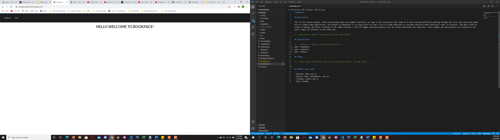
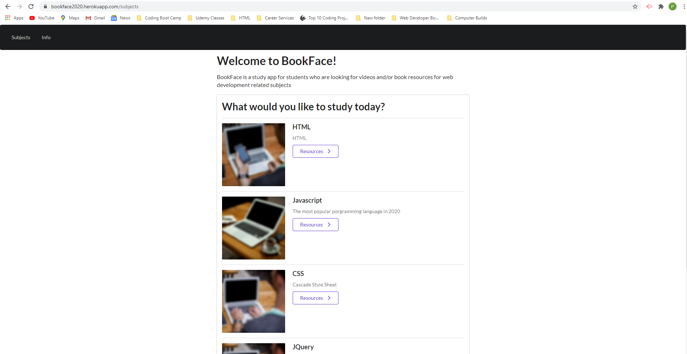
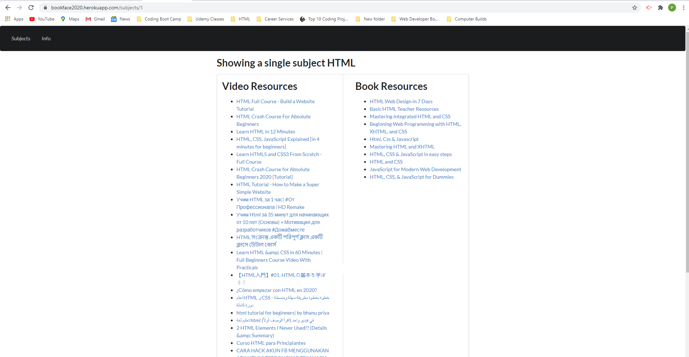

# Bookface

## Description

This is our second project. After discussing ideas and common interests, we came to the conclusion that some of us were having difficulty getting through the class and could have made use of a good study application. The purpose of Bookface is to allow users to view a list of study materials or youtube tutorials when entering a topic of interest. The main field of study is coding, and after clicking on the submit button, a list of images and descriptions will be listed underneath the input bar. These images and descriptions are related to the user's topic of interest in the input bar.

<!-- Need better idea of features to go into more detail -->

## Installation

<!-- Guidance or steps on installation process -->
npm i handlebar
npm i sequelize
npm i express

## Usage

<!-- Insert main screenshots here to show expected output. Include links. -->

## Authors and tasks

* Mariana: APIs and js
* Karuna: html, handlebars, and css
* Faranak: routes and js
* Paul: Readme