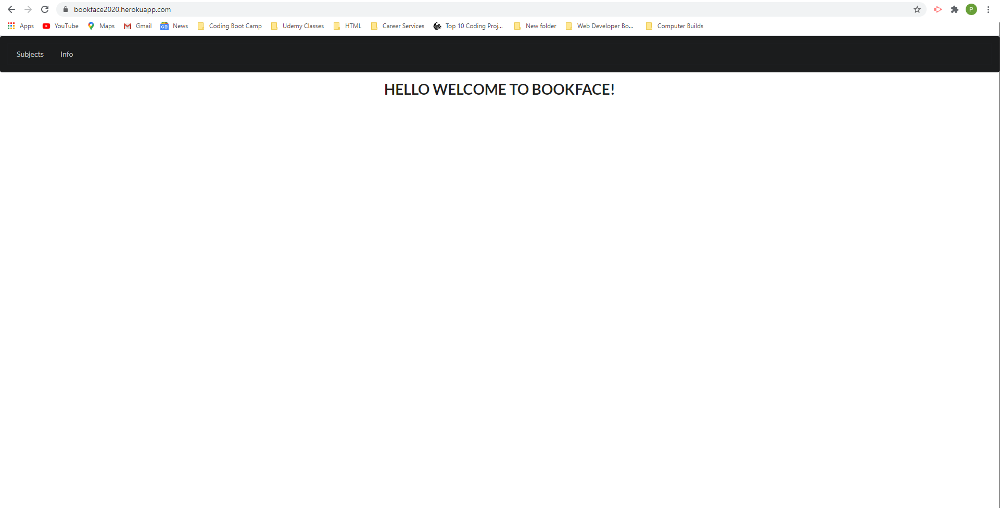

# 
Bookface

## 
Description

 

This is our second project. After discussing ideas and common interests, we came to the conclusion that some of us were having difficulty getting through the class and could have made use of a good study application. The purpose of Bookface is to allow users to view a list of youtube tutorials and book resources after clicking on one of the topics of interest, which are listed after clicking on the Subjects tab. All topics are related to what we are learning in this class, and after clicking on a topic button, a list of links will be displayed in two columns. One column has all the YouTube video links, and the other has all the book links.

<!-- Need better idea of features to go into more detail -->

## 
Installation

 

<!-- Guidance or steps on installation process -->
* npm i express
* npm i sequelize
* npm i handlebars

## 
Technologies Used

 

* HTML
* CSS
* Javascript
* Handlebars
* Bootstrap
* Node.js
* Sequelize
* MySQL
* Express
* Dotenv
* Passport
* Google Books API
* YouTube API
* Semantic UI

## 
Usage

 

<!-- Screenshots go here -->

## 
Links

 

<!-- Github and heroku links -->
* https://github.com/karunasato/BookFace/
* https://bookface2020.herokuapp.com/

## 
Authors and tasks

 

* Mariana: APIs and js
* Karuna: html, handlebars, and css
* Faranak: routes and js
* Paul: Readme